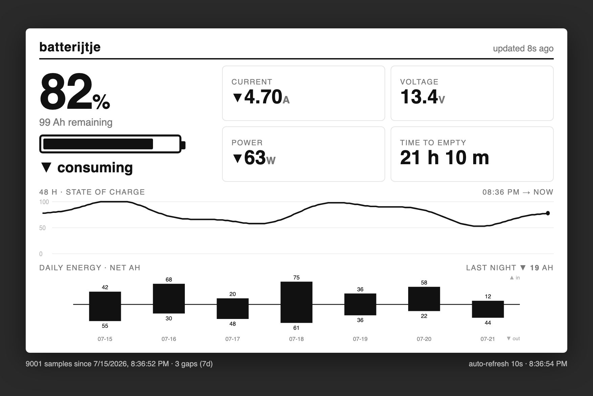

# batterijtje

*A Raspberry Pi Zero that watches a campervan's LiFePO4 battery over Bluetooth
and keeps the history the vendor app throws away.*



> The dashboard is a monochrome **800×480** layout — deliberately the prototype for
> the planned e-ink display, so whatever you tune in the browser ports straight to the
> HAT. *(Screenshot shows representative data.)*

An always-on logger + dashboard for the LiFePO4 battery in a campervan
(**ECTIVE Accubox 120S** power station). It polls the battery's BLE BMS, stores
history in SQLite, and serves a small e-ink-style web dashboard — building the
intuition for real-world off-grid usage (daily Ah, overnight drain, solar yield)
that the battery's own app throws away.

See [`van-battery-logger-brief.md`](van-battery-logger-brief.md) for the original
project brief and [`CLAUDE.md`](CLAUDE.md) for the short "read before editing" notes.

## Hardware / platform

- **Raspberry Pi Zero W v1.1** (ARMv6), Raspberry Pi OS Lite 32-bit, powered from
  the Accubox's own USB-A port — so the logger shows up in its own data as a ~1 W load.
- Battery: ECTIVE LC-series LiFePO4 with a Topband BLE BMS.
- Future: Waveshare 7.5" e-ink HAT (800×480) over SPI (SPI already enabled).

## Architecture

```
logger.py   — BLE poll every 15 s (poll-and-disconnect) → append SQLite (WAL)
webapp.py   — Flask, read-only DB → JSON API + dashboard on :8080
web/index.html — single 800×480 panel (e-ink prototype), auto-refresh 10 s
```

Both run as systemd services (`batterylogger`, `batteryweb`), enabled on boot,
`Restart=always`. The dashboard opens the DB read-only, so it never blocks the
logger (WAL allows one writer + concurrent readers).

## The BLE protocol (reverse-engineered)

Not documented publicly for the Accubox; recovered by decompiling the ECTIVE
**BM X** Android app (`com.lipower.battery`). Key facts:

- Device advertises name like `23-03-28-076`, service `0xAF30`; comms on
  characteristic `0xFFE1` (service `0xFFE0`), **write-without-response** + notify.
- It speaks **Modbus-RTU over BLE**. The **Modbus slave id is the last dash-segment
  of the advertised name** — `23-03-28-076` → slave `76` (`0x4C`). (This was the
  whole puzzle: public scripts hardcode another unit's id.)
- **Status request** = read-holding-registers(slave, `0x0400`, 8):
  `4C 03 04 00 00 08 <crc16-le>`. Reply is a 21-byte big-endian frame:

  | bytes | field | scale |
  |-------|-------|-------|
  | 3–4   | remaining Ah | ×1 |
  | 5–6   | SoC % | — |
  | 7–8 / 9–10 | remaining time | h / min — *to empty* when discharging, *to full* when charging |
  | 11–12 | direction | 0 = charging (+), else discharging (−) |
  | 13–14 | current | ×0.01 A |
  | 15–16 | voltage | ×0.1 V |
  | 17–18 | power | W |

`logger.py` is self-contained (its own CRC-16/Modbus; no dependency on the
`aiobmsble` plugin, which does not support this slave-id-from-name scheme).

## Repo layout

```
batterylogger/
  logger.py            BLE → SQLite logger
  webapp.py            Flask dashboard backend
  web/index.html       dashboard (self-contained, no CDN)
  requirements.txt     pip deps (installed into the Pi venv)
  deploy.sh            scp code to the Pi + restart services
  systemd/             unit files + fake-hwclock 15-min save override
van-battery-logger-brief.md   original brief
handoff-0*.md          design suggestions (assessed; most applied)
```

## Setup (fresh Pi)

```bash
# System deps
sudo apt update && sudo apt full-upgrade
sudo raspi-config nonint do_spi 0            # SPI for the future e-ink HAT
sudo apt install -y rfkill iw wireless-tools fake-hwclock

# Python env
python3 -m venv ~/batterylogger/venv
~/batterylogger/venv/bin/pip install -r requirements.txt

# WiFi power-save off (shared radio → BLE reliability); see docs

# Install services (substitute your Pi user for the __USER__ placeholder):
for u in batterylogger batteryweb; do
  sed "s/__USER__/$USER/g" systemd/$u.service | sudo tee /etc/systemd/system/$u.service >/dev/null
done
sudo systemctl enable --now batterylogger batteryweb
```

## Deploy changes

```bash
cd batterylogger && ./deploy.sh user@hostname.local   # or: export DEPLOY_TARGET=...
```

## Data notes

- **Net measurement.** The Accubox exposes one current (charge − load) at the
  terminal; gross solar vs gross load cannot be separated in software. Daily bars
  are *net*. The overnight window (22:00–06:00, when nothing charges) is the clean
  "will we make it to morning?" figure.
- **Timestamps are UTC epoch** in the DB; the web layer localises with
  `LOCAL_TZ = Europe/Amsterdam`.
- **No RTC**: `fake-hwclock` keeps the clock roughly right across power cuts and
  each sample carries a `synced` flag. A DS3231 on I²C is the planned proper fix.

## Status / roadmap

- [x] Logger + dashboard running, boot-persistent, survives WiFi drops & reboots
- [x] Clock guard (fake-hwclock + synced flag)
- [x] Net labelling, overnight-load metric, trapezoidal integration, gap accounting
- [ ] DS3231 RTC on I²C
- [ ] E-ink render (Pillow → PNG → HAT), reusing the dashboard layout
- [ ] Move development to the spare Pi 3

## Disclaimer

Not affiliated with or endorsed by ECTIVE. The BLE protocol described here is an
independent description recovered for **interoperability** with a device
the author owns — it contains none of the vendor app's code. "ECTIVE" and "AccuBox"
are trademarks of their respective owner.
