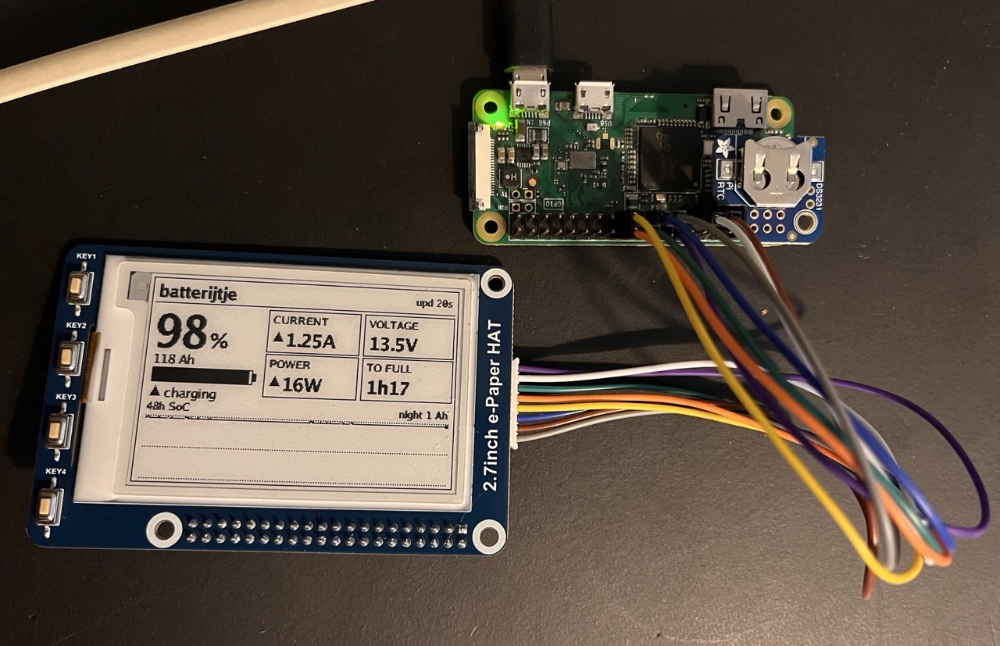
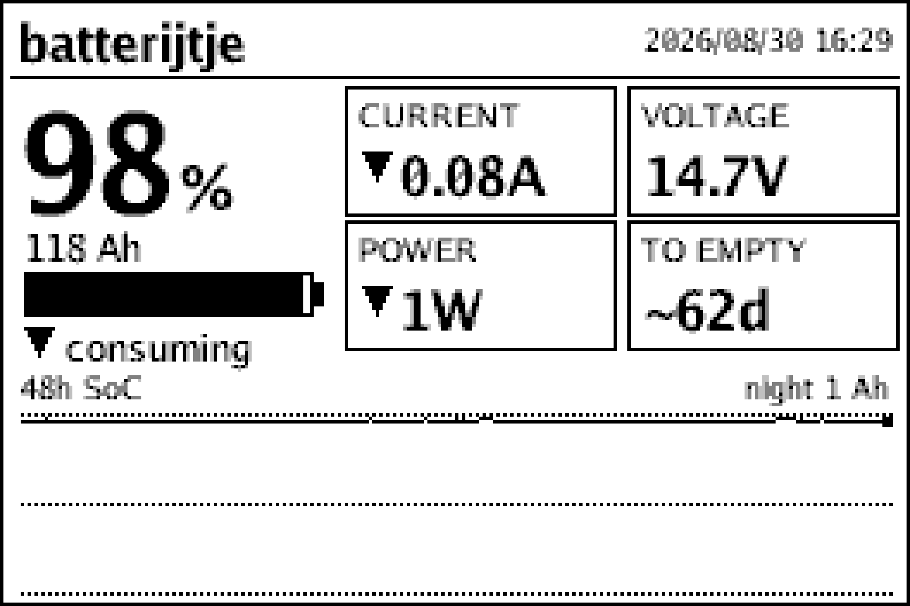

# batterijtje

*A Raspberry Pi Zero that watches a campervan's LiFePO4 battery over Bluetooth
and keeps the history the vendor app throws away.*



> The live dashboard on its **2.7″ e-ink panel** (264×176), rendered by a small Go
> binary straight from the SQLite log and repainted every 10 minutes. The DS3231
> RTC (top-right) keeps the clock across power-cuts.



> The frame the renderer draws — 264×176: a wall-clock timestamp, the SoC
> hero + battery bar, Current / Voltage / Power / time-to-empty tiles, and a 48 h
> state-of-charge sparkline. The small text is a **bitmap font** drawn on the pixel
> grid, so it stays sharp with no antialiasing to lean on; only the big numbers are
> an outline face. *(Home-float data; numbers cycle on a trip.)*

An always-on logger + e-ink dashboard for the LiFePO4 battery in a campervan
(**ECTIVE Accubox 120S** power station). It polls the battery's BLE BMS, stores
history in SQLite, and renders a compact dashboard onto the e-ink panel —
building the intuition for real-world off-grid usage (daily Ah, overnight drain,
solar yield) that the battery's own app throws away. There's no always-on web UI;
for a remote look, the renderer dumps the current frame to a PNG on demand.

See [`van-battery-logger-brief.md`](van-battery-logger-brief.md) for the original
project brief and [`CLAUDE.md`](CLAUDE.md) for the short "read before editing" notes.
Notable changes are tracked in [`CHANGES.md`](CHANGES.md).

## Hardware / platform

- **Raspberry Pi Zero W v1.1** (ARMv6), Raspberry Pi OS Lite 32-bit, powered from
  the Accubox's own USB-A port — so the logger shows up in its own data as a ~1 W load.
- Battery: ECTIVE LC-series LiFePO4 with a Topband BLE BMS.
- **Waveshare 2.7" e-Paper HAT** (264×176, V2) over SPI + a **DS3231 RTC** on I²C —
  both installed, driven by the `batteryeink` Go daemon. The HAT's 4 buttons are
  wired too (KEY1–4 = BCM 5/6/13/19).

## Architecture

```
logger.py         — BLE poll every 15 s (poll-and-disconnect) → append SQLite (WAL)
eink/batteryeink  — Go daemon: read SQLite (read-only) → render 264×176 → e-Paper HAT
```

`batterylogger.service` runs the logger (boot-enabled, `Restart=always`);
`batteryeink.service` is a daemon that repaints the panel every 10 min **and** on
the HAT's 4 buttons. The renderer opens the DB read-only, so it never blocks the
logger (WAL allows one writer + concurrent readers). A `wifi-watchdog` daemon
keeps the Pi reachable for remote access.

**Buttons:** **KEY1** force-refresh · **KEY2** cycle the sparkline window
(24 h / 48 h / 7 d) · **KEY3** WiFi on/off (radio only — Bluetooth/BLE keep
running; pauses the watchdog while off) · **KEY4** tap = system-info screen,
hold 3 s = graceful power-off.

## The BLE protocol (reverse-engineered)

Not documented publicly for the Accubox; recovered by decompiling the ECTIVE
**BM X** Android app (`com.lipower.battery`). Key facts:

- Device advertises name like `23-03-28-076`, service `0xAF30`; comms on
  characteristic `0xFFE1` (service `0xFFE0`), **write-without-response** + notify.
- It speaks **Modbus-RTU over BLE**. The **Modbus slave id is the last dash-segment
  of the advertised name** — `23-03-28-076` → slave `76` (`0x4C`). (This was the
  whole puzzle: public scripts hardcode another unit's id.)
- **Status request** = read-holding-registers(slave, `0x0400`, 8):
  `4C 03 04 00 00 08 <crc16-le>`. Reply is a 21-byte big-endian frame:

  | bytes | field | scale |
  |-------|-------|-------|
  | 3–4   | remaining Ah | ×1 |
  | 5–6   | SoC % | — |
  | 7–8 / 9–10 | remaining time | h / min — *to empty* when discharging, *to full* when charging |
  | 11–12 | direction | 0 = charging (+), else discharging (−) |
  | 13–14 | current | ×0.01 A |
  | 15–16 | voltage | ×0.1 V |
  | 17–18 | power | W |

`logger.py` is self-contained (its own CRC-16/Modbus; no dependency on the
`aiobmsble` plugin, which does not support this slave-id-from-name scheme).

## Repo layout

```
batterylogger/
  logger.py            BLE → SQLite logger
  eink/                batteryeink — Go renderer for the 2.7" e-Paper HAT
  requirements.txt     pip deps for the logger (installed into the Pi venv)
  deploy.sh            scp the logger to the Pi + restart it
  systemd/             unit files (logger, wifi-watchdog, eink daemon, ...)
van-battery-logger-brief.md   original brief
handoff-0*.md          design suggestions (assessed; most applied)
```

`batteryeink` is pure Go and cross-compiles to the Pi Zero's ARMv6 with no
toolchain (`CGO_ENABLED=0 GOOS=linux GOARCH=arm GOARM=6`; see `eink/build.sh`).
It reads the SQLite DB read-only (pure-Go `modernc.org/sqlite`), draws a 264×176
1-bit frame, and drives the panel over SPI (`periph.io`), repainting every 10 min
and on a button press. Repaints are **partial** (differential, non-flashing,
~1 s); a full flashing refresh is spent on screen changes, every 6 partials, once
a day, and on KEY1. `./batteryeink -nopaint -png out.png` dumps the current
frame for a remote look — add `-mono` for the 1-bit version, `-scale N` to
upscale, and `-screen sysinfo|message` for the other two frames. (An earlier
Flask/Go **web** dashboard was retired once the e-ink renderer became
self-sufficient; it lives in git history.)

## Setup (fresh Pi)

```bash
# System deps
sudo apt update && sudo apt full-upgrade
sudo raspi-config nonint do_spi 0            # SPI for the e-ink HAT
sudo raspi-config nonint do_i2c 0            # I²C for the DS3231 RTC
sudo apt install -y rfkill iw wireless-tools i2c-tools
echo "dtoverlay=i2c-rtc,ds3231" | sudo tee -a /boot/firmware/config.txt   # RTC
# Fit a CR1220 coin cell in the DS3231 so it keeps time while the Pi is off.

# Python env (just the BLE logger)
python3 -m venv ~/batterylogger/venv
~/batterylogger/venv/bin/pip install -r requirements.txt

# WiFi power-save off (the shared WiFi/BT radio starves BLE otherwise):
printf '[connection]\nwifi.powersave = 2\n' | \
  sudo tee /etc/NetworkManager/conf.d/wifi-powersave-off.conf >/dev/null

# Build + copy the e-ink renderer (from a dev machine with Go):
( cd batterylogger/eink && ./build.sh )
scp batterylogger/eink/batteryeink $USER@host:~/batterylogger/

# Install services (substitute your Pi user for the __USER__ placeholder):
sudo install -m 755 systemd/wifi-watchdog.sh /usr/local/sbin/   # watchdog daemon script
for u in batterylogger wifi-watchdog batteryeink; do
  sed "s/__USER__/$USER/g" systemd/$u.service | sudo tee /etc/systemd/system/$u.service >/dev/null
done
sudo systemctl enable --now batterylogger wifi-watchdog batteryeink
```

(The KEY3/KEY4 button actions need passwordless `sudo` for the `batteryeink`
user — `nmcli radio wifi`, `systemctl` on the watchdog, and `poweroff`.)

## Deploy changes

```bash
cd batterylogger && ./deploy.sh user@hostname.local   # or: export DEPLOY_TARGET=...
```

## Data notes

- **Net measurement.** The Accubox exposes one current (charge − load) at the
  terminal; gross solar vs gross load cannot be separated in software, so the daily
  Ah figures are *net*. The overnight window (22:00–06:00, when nothing charges) is
  the clean "will we make it to morning?" figure.
- **Timestamps are UTC epoch** in the DB; the renderer localises to
  `Europe/Amsterdam` for the overnight-window figure.
- **DS3231 RTC** on I²C (`dtoverlay=i2c-rtc,ds3231`) keeps the clock correct
  across power-cuts on its coin cell; each sample still carries a `synced` flag.

## Status / roadmap

- [x] Logger + e-ink dashboard running, boot-persistent, survives WiFi drops & reboots
- [x] Clock guard (started as `fake-hwclock` + a `synced` flag; now a real RTC)
- [x] Net labelling, overnight-load metric, trapezoidal integration, gap accounting
- [x] DS3231 RTC on I²C (`dtoverlay=i2c-rtc,ds3231`; retired `fake-hwclock`)
- [x] E-ink render to a Waveshare 2.7″ HAT — `batteryeink` (Go), repainting every 10 min
- [x] Grayscale (4-level) e-ink rendering for smoother text (superseded by the
      bitmap font + mono; still reachable with `-4gray`)
- [x] Bitmap font for the small text — 1-bit renders sharp without antialiasing
- [x] Partial (non-flashing) refresh — 0.99 s vs 6.01 s for the old 4-grey paint
- [x] E-ink reads SQLite directly; web dashboard retired (renderer is self-sufficient)
- [ ] Re-verify the coin-cell backup after the RTC solder rework
- [x] Utilise the 4 HAT buttons (refresh · window · WiFi · info/power-off)
- [ ] 3D-printed housing
- [ ] Log a full multi-day off-grid trip → tag **1.0**
- [ ] Move development to the spare Pi 3

## License

[MIT](LICENSE) © 2026 Jan-Wijbrand Kolman. The reverse-engineered protocol
description is provided for interoperability (see below) and contains no vendor code.

## Disclaimer

Not affiliated with or endorsed by ECTIVE. The BLE protocol described here is an
independent description recovered for **interoperability** with a device
the author owns — it contains none of the vendor app's code. "ECTIVE" and "AccuBox"
are trademarks of their respective owner.
